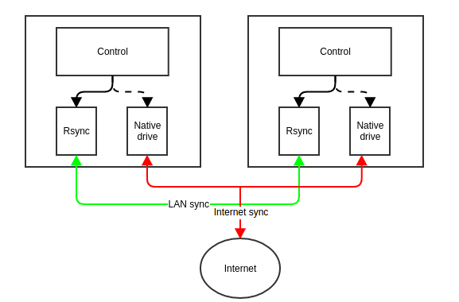
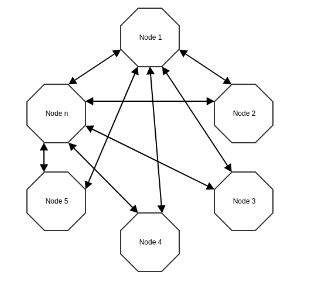

Bài toán sau khi quy về tìm kiếm các máy cùng mạng LAN và đồng bộ dữ liệu qua mạng LAN trước, giải pháp đề xuất như sau:

- Tìm kiếm IP cùng mạng LAN: broadcast vào cùng mạng LAN qua địa chỉ broadcast: x.x.x.255

Kiến trúc chương trình:

- Control Module
Mở một PORT socker
Tìm kiếm các node khác có mở PORT
Chuyển chế độ đồng bộ qua LAN/ qua internet
- Rsync Module 
Theo dõi và đồng bộ trong mạng LAN
- Native drive module (such as: gg drive, onedrive):
Làm nhiệm vụ của chính nó

​

Chiến lược tìm kiếm các node trong cùng mạng LAN mà đang được chạy chương trình đồng bộ qua mạng LAN

- Sử dụng broadcast trong dải mạng LAN
- Nhận phản hồi theo đúng format thì xác nhận và cập nhật vào danh sách các node đã tìm thấy
Nếu danh sách rỗng thì bật đồng bộ qua internet
Nếu danh sách KHÁC rỗng thì tắt chương trình Native đồng bộ qua internet, bật chế độ đồng bộ qua Rsync
- Lặp lại như 2 bước trên

Mở rộng bài toán

​

Khi bài toán mở rộng với nhiều node,
làm sao để thông báo và đồng bộ nhanh tới các node khác
giảm băng thông và các request tập trung vào duy nhất vào một node.

Sử dụng chiến lược lan truyền thông tin và lựa chọn một thuật toán lan truyền (cần đề xuất và thử nghiệm để lựa chọn được thuật toán tốt nhất) để thực hiện được các yêu cầu trên.